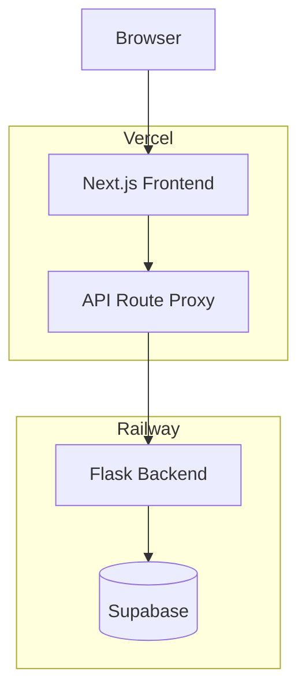
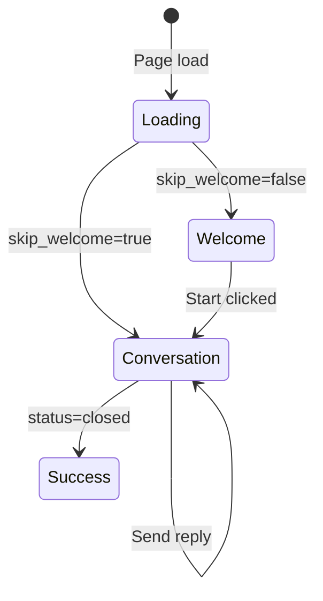

# Frontend Rebuild Plan

## Pre-work: Commit Current State to Staging

Before any changes, commit all current work to the `staging` branch to preserve the existing injected-script approach as a fallback. This includes pushing `staging` to remote so the rollback point is accessible.

## Architecture Overview



## Tech Stack

- **Framework**: Next.js 14 (App Router)
- **Language**: TypeScript
- **Styling**: Tailwind CSS + shadcn/ui components
- **State**: React hooks + Context (no Redux needed)
- **Voice**: Native `getUserMedia` + `MediaRecorder` (standard browser APIs)
- **Deployment**: Vercel (frontend) + Railway (backend, unchanged)

## Directory Structure

New `/frontend` folder in the same repo:

```
/frontend
├── app/
│   ├── layout.tsx              # Root layout with providers
│   ├── page.tsx                # Redirect or landing
│   ├── interview/
│   │   └── page.tsx            # Main interview UI
│   ├── results/
│   │   ├── page.tsx            # Admin projects list
│   │   ├── [projectId]/
│   │   │   └── page.tsx        # Admin project view
│   │   └── share/
│   │       └── [token]/
│   │           └── page.tsx    # Customer share view
│   └── api/
│       └── [...path]/
│           └── route.ts        # Proxy to Railway backend
├── components/
│   ├── interview/
│   │   ├── ChatMessage.tsx
│   │   ├── InputArea.tsx
│   │   ├── VoiceButton.tsx     # Simplified mic button
│   │   ├── ProgressBar.tsx
│   │   └── WelcomeScreen.tsx
│   ├── results/
│   │   ├── SessionList.tsx
│   │   ├── Transcript.tsx
│   │   └── ...
│   └── ui/                     # shadcn components
├── hooks/
│   ├── useInterview.ts         # Interview state + API
│   ├── useVoice.ts             # Voice recording logic
│   └── useProject.ts           # Project config
├── lib/
│   ├── api.ts                  # API client
│   └── utils.ts
├── tailwind.config.ts
├── next.config.js
└── package.json
```

## Feature 1: Interview Flow

### Screens

1. **Welcome** (if `skip_welcome=false`): Logo, title, message, consent checkbox, email input (optional), Start button
2. **Conversation**: Messenger-style chat, input area with voice button, progress bar
3. **Success**: Title, message, optional restart button

### API Integration

- `GET /api/project/` - Load project config (headers: `projectId`)
- `POST /api/respondent/` - Create session (headers: `projectId`, `externalId`)
- `GET /api/interview/` - Initialize conversation (headers: `projectId`, `uuid`)
- `POST /api/reply/` - Send message, receive response (supports streaming SSE)
- `POST /api/voice-transcribe/` - Upload audio, get transcript

### State Flow



## Feature 2: Voice Input (Simplified UX)

### User-requested simplification

- **Single button**: Mic icon (no undo/copy/clear buttons)
- **Recording state**: Mic becomes red stop square, input glows with pulse animation
- **Stop**: Populates input with transcript
- **Re-record**: Clicking mic again appends new text as suffix

### Component: `VoiceButton.tsx`

```tsx
// Simplified state machine
type VoiceState = "idle" | "recording" | "processing";

// Visual states:
// idle: mic icon, gray border
// recording: red square icon, red border, input has pulsing glow
// processing: spinner, disabled
```

### Voice Hook: `useVoice.ts`

- Request mic permission via `getUserMedia({ audio: { echoCancellation, noiseSuppression, autoGainControl } })`
- Record with `MediaRecorder`
- On stop: POST to `/api/voice-transcribe/`
- Return transcript to parent, which appends to input value

### Fallbacks

- No HTTPS: Show tooltip "Microphone requires HTTPS"
- No MediaRecorder (Safari): Show file upload input as fallback
- Permission denied: Show inline banner with retry + help text

## Feature 3: Results Portal

### Admin Routes (`/results/*`)

- `/results` - Projects list
- `/results/[projectId]` - Project view with tabs (Results, Topics, Usage, Settings)

### Share Routes (`/results/share/[token]`)

- Password gate
- Read-only transcript view
- Export functionality

### Reuse existing Results UI

The current `results-ui/` Vite app can be migrated to Next.js pages with minimal changes - same components, just moved to App Router structure.

## Deployment Configuration

### Frontend (Vercel)

Deploy as a separate Vercel project rooted at `/frontend` to avoid conflicts with the existing `vercel.json` that routes everything to `static/index.html`.

New `frontend/vercel.json`:

```json
{
  "rewrites": [
    { "source": "/api/:path*", "destination": "/api/:path*" },
    { "source": "/:path*", "destination": "/:path*" }
  ]
}
```

### API Proxy Route

`frontend/app/api/[...path]/route.ts `proxies all `/api/*` calls to `QVANTIFY_RAILWAY_URL` (same pattern as current `api/[...path].cjs`).

### Environment Variables (Vercel)

- `QVANTIFY_RAILWAY_URL` - Backend URL (e.g., `https://qvantify-backend.railway.app`)

## Migration Steps

1. **Commit to staging** - Preserve current state and push `staging` to remote
2. **Scaffold Next.js** - Create `/frontend` with Next.js 14 + TypeScript + Tailwind
3. **Build Interview UI** - Welcome, Conversation, Success screens
4. **Build Voice Button** - Simplified mic UX with recording states and strict API headers (`projectId`, `uuid`)
5. **Build API Proxy** - Route handler to Railway backend
6. **Migrate Results Portal** - Reuse `results-ui/src` components and adapt to App Router
7. **Configure Vercel** - Deploy frontend as separate project, set env vars
8. **Update scope.md** - Document new architecture
9. **E2E Tests** - Update Playwright tests for new frontend

## Files to Remove (After Migration Complete)

- `static/index.html` (the injected-script mess)
- `static/static/js/*.js` (old React Native Web bundle)
- `results-ui/` (merged into `/frontend`)

## Timeline Estimate

Not providing time estimates per your preference - this is the logical sequence of work.

## Test Matrix (Required)

- **Local (mocked)**: voice flow test with mocked `/api/project/` + `/api/voice-transcribe/`
- **Staging (live backend)**: interview flow, voice recording, transcription insert, refresh resiliency
- **Results portal**: admin + share flows on staging