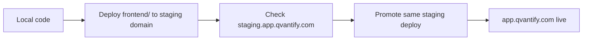
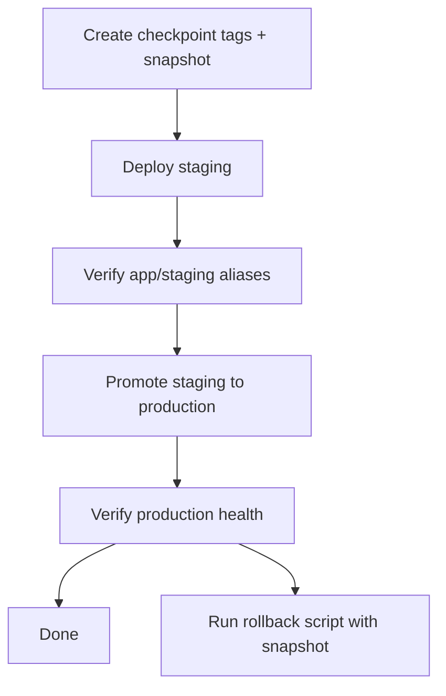

# Qvantify Deploy

## System Map (baby-language)

- Repo `qvantify-backend` = full codebase (frontend + backend).
- Vercel project `qvantify-frontend` = real web domains:
  - `staging.app.qvantify.com`
  - `app.qvantify.com`
- Vercel project `qvantify-fullstack` = legacy only. Do not use it for app/staging domains.
- Railway:
  - staging backend: `https://qvantify-staging.up.railway.app`
  - production backend: `https://qvantify.up.railway.app`

## Simple Flow



## Safety-First Flow



## Commands

### 1) Create checkpoint before risky changes

```bash
python3 scripts/create_checkpoint.py --name "<date-or-release>"
python3 scripts/rollback_domains.py --snapshot "ops/checkpoints/checkpoint-<date-or-release>.json"
```

### 2) Deploy frontend to staging

```bash
vercel link --cwd frontend --project qvantify-frontend --scope nikita-shilenoks-projects --yes
vercel deploy --cwd frontend --local-config frontend/vercel.json --target=preview --yes
vercel alias set <preview-url> staging.app.qvantify.com
python3 scripts/verify_domain_aliases.py
```

### 3) Promote staging frontend to production

```bash
python3 scripts/promote_frontend_from_staging.py --apply
python3 scripts/verify_domain_aliases.py
```

### 4) One-command rollback

```bash
python3 scripts/rollback_domains.py --snapshot "ops/checkpoints/checkpoint-<name>.json" --apply
```

## Mandatory Rules

- Always deploy frontend from `frontend/`.
- Always keep `app.qvantify.com` and `staging.app.qvantify.com` on `qvantify-frontend-*` deployments.
- Never alias app/staging domains to `qvantify-fullstack`.
- Always create a checkpoint before branch realignment or production promotion.

## Reference

- Full runbook: `references/pipeline.md`
